<div align="center">

# 🧠 VIRQA — AI Interview Platform
## Complete System Architecture & Flow Documentation

> **Version:** 1.0.0 &nbsp;|&nbsp; **Platform:** Full-Stack Web Application &nbsp;|&nbsp; **AI-Powered:** Yes  
> **Institution:** University of Central Punjab (UCP) — Final Year Project (F22)  
> **Author:** Muhammad Ummar &nbsp;|&nbsp; **Category:** Artificial Intelligence × Human Resources

---

*This document provides an exhaustive technical reference for the VIRQA AI Interview Platform — covering every actor, data flow, API contract, AI service pipeline, database schema, and real-time Socket.io event across all 9 phases of the interview lifecycle.*

</div>

---

## 📋 Table of Contents

| # | Section | Description |
|---|---|---|
| 0 | [System Overview](#0-system-overview) | Architecture at a glance |
| 1 | [Technology Stack](#1-technology-stack) | Actors, interfaces, and tools |
| 2 | [Phase 1 — Interview Creation](#2-phase-1--interview-session-creation) | HR creates and dispatches sessions |
| 3 | [Phase 2 — Candidate Auth & Lobby](#3-phase-2--candidate-authentication--lobby) | Login, password flow, mic check |
| 4 | [Phase 3 — AI Initialization](#4-phase-3--ai-interview-initialization) | Session creation and socket join |
| 5 | [Phase 4 — Question Generation](#5-phase-4--real-time-ai-question-generation) | Groq LLM contextual Q generation |
| 6 | [Phase 5 — Audio Pipeline](#6-phase-5--audio-answer-processing-pipeline) | Record → STT → Evaluate |
| 7 | [Phase 6 — Adaptive Difficulty](#7-phase-6--adaptive-difficulty-engine) | Dynamic scoring-based difficulty |
| 8 | [Phase 7 — DB Persistence](#8-phase-7--database-write-after-each-answer) | Per-answer data save cycle |
| 9 | [Phase 8 — Completion & Report](#9-phase-8--interview-completion--final-report) | Final scoring and status sync |
| 10 | [Phase 9 — Admin Monitoring](#10-phase-9--admin-audit--monitoring) | Admin Dashboard & audit trails |
| 11 | [Data Models](#11-complete-data-model-relationships) | MongoDB entity relationships |
| 12 | [Socket.io Reference](#12-complete-socketio-event-reference) | All real-time events documented |

---

## 0. System Overview

VIRQA is an AI-powered, end-to-end interview automation platform. It enables HR employees to schedule technical interviews, invites candidates automatically via email, and conducts fully automated AI interviews using voice recognition and LLM-based evaluation — all in real-time.

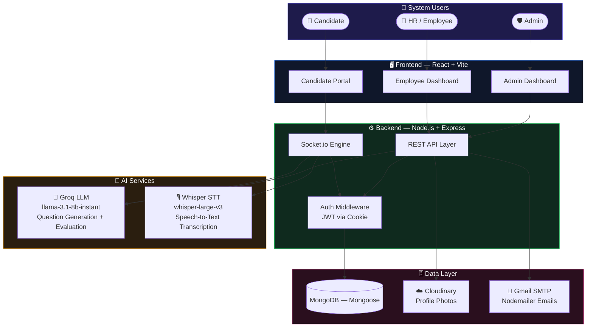

---

## 1. Technology Stack

### 👥 Actors & Their Interfaces

| Actor | Dashboard | Primary Actions |
|---|---|---|
| 🛡️ **Admin** | Admin Dashboard — React + Vite | Audit interviews, manage employees, view global reports |
| 👔 **HR / Employee** | Employee Dashboard — React + Vite | Create sessions, invite candidates, view results |
| 👤 **Candidate** | Candidate Portal — React + Vite | Accept invite, take AI interview, view their scores |

### 🔧 Technology Reference

| Layer | Technology | Purpose |
|---|---|---|
| **Frontend** | React 18 + Vite + TanStack Query | UI rendering, API state management |
| **Real-time** | Socket.io (Client + Server) | Bidirectional audio/event streaming |
| **Backend** | Node.js + Express 5 | REST API + socket event processing |
| **Auth** | JWT (stored in HttpOnly Cookie) | Secure session management |
| **LLM — Questions** | Groq API · `llama-3.1-8b-instant` | Generates dynamic interview questions |
| **LLM — Evaluation** | Groq API · `llama-3.1-8b-instant` | Scores and provides feedback on answers |
| **Speech-to-Text** | Groq Whisper · `whisper-large-v3` | Converts candidate audio to text |
| **Database** | MongoDB + Mongoose (Discriminator pattern) | Document storage with inheritance |
| **File Storage** | Cloudinary | Profile photo upload and hosting |
| **Email** | Nodemailer + Gmail SMTP | Interview invites, OTP, reschedule alerts |

---

## 2. Phase 1 — Interview Session Creation

> **Who:** HR Employee &nbsp;|&nbsp; **When:** Before any candidate joins &nbsp;|&nbsp; **Outcome:** `InterviewSession` saved + emails dispatched

In this phase, the Employee fills out an interview creation form. Optionally, they can request the AI to generate a tailored system prompt based on the job description. For each candidate email provided, the system finds or creates an account, then dispatches a personalized invitation email containing temporary credentials.

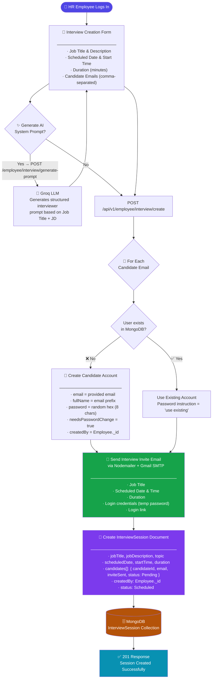

---

## 3. Phase 2 — Candidate Authentication & Lobby

> **Who:** Candidate &nbsp;|&nbsp; **When:** After receiving the invite email &nbsp;|&nbsp; **Outcome:** Candidate enters Lobby and performs Mic Check

The candidate receives an email with credentials. On first login, they are forced to set a new password. Once authenticated, they see their scheduled interviews and enter a Lobby component that checks microphone health with a live audio visualizer before starting.

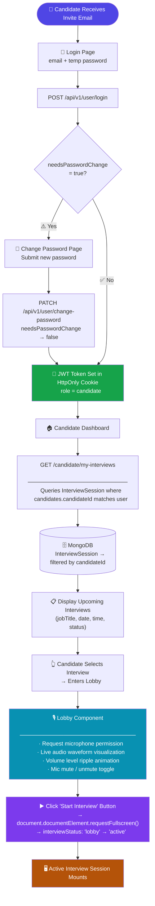

---

## 4. Phase 3 — AI Interview Initialization

> **Who:** Backend + Candidate Frontend &nbsp;|&nbsp; **When:** Active Session component mounts &nbsp;|&nbsp; **Outcome:** `AIInterview` document created, socket room joined, first question emitted

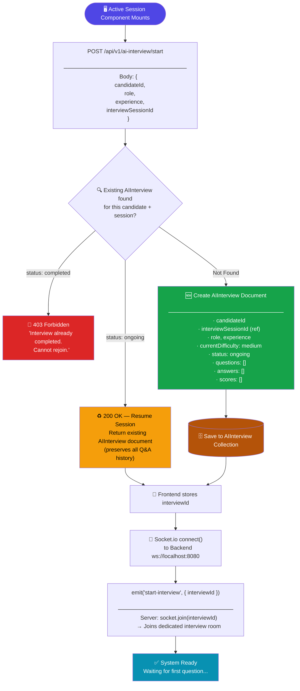

---

## 5. Phase 4 — Real-Time AI Question Generation

> **Service:** `questionService.js` &nbsp;|&nbsp; **AI Model:** `llama-3.1-8b-instant` via Groq &nbsp;|&nbsp; **Temperature:** 0.7 (creative, varied)

The question generation service is **context-aware**. It receives the full history of all previous questions and answers to ensure continuity, relevance, and non-repetition. The difficulty level is dynamically passed in and can change after every answer.

```mermaid
flowchart LR
    A(["📨 'start-interview' event received"]) --> B

    B["🔍 Fetch AIInterview from DB
    (role, experience, difficulty, history)"]

    B --> CHK{"📊 Is last question
    still unanswered?"}

    CHK -->|"✅ Yes (Resume)"| REEMIT
    REEMIT["🔁 Re-emit last question text
    (prevents duplicate Q generation
    on page refresh / reconnect)"]

    CHK -->|"❌ No (Fresh)"| CTX

    CTX["🏗️ Build Context Object
    ─────────────────────────────
    context = {
      role: 'Frontend Developer',
      experience: 'Intermediate',
      difficulty: 'medium',
      history: [
        { question: '...', answer: '...' },
        ...
      ]
    }"]

    CTX --> GEN["🤖 questionService.generateQuestion(context)"]

    GEN --> GROQ["☁️ Groq API Call
    ─────────────────────────────
    model: llama-3.1-8b-instant
    temperature: 0.7 (varied output)
    max_tokens: 150
    ─────────────────────────────
    Prompt structure:
    · Role + Difficulty instruction
    · Full Q&A history (if any)
    · Output: question text ONLY
    · No markdown, no prefixes"]

    GROQ --> SUCCESS{API Success?}

    SUCCESS -->|"✅ Yes"| QTEXT["📝 Generated Question Text"]
    SUCCESS -->|"❌ No (Fallback)"| FB
    FB["📝 Fallback: 'Describe a challenging
    problem you solved recently for {role}'"]

    QTEXT --> SAVEQ
    FB --> SAVEQ

    SAVEQ["💾 Save to AIInterview.questions[]
    { text: questionText, askedAt: Date }"]

    SAVEQ --> EMIT["📡 emit('next-question', { questionText })
    → Sent to candidate's socket room"]

    EMIT --> DISPLAY["🖥️ Candidate sees question
    + TTS reads it aloud"]

    REEMIT --> DISPLAY

    style A fill:#4f46e5,color:#fff
    style GROQ fill:#b45309,color:#fff
    style EMIT fill:#16a34a,color:#fff
    style DISPLAY fill:#0891b2,color:#fff
```

---

## 6. Phase 5 — Audio Answer Processing Pipeline

> **Services:** `sttService.js` + `evaluationService.js` &nbsp;|&nbsp; **Models:** Whisper large-v3 + llama-3.1-8b-instant &nbsp;|&nbsp; **Execution:** Sequential, real-time status emitted at each stage

This is the core AI pipeline. After the candidate finishes speaking, the raw `.webm` audio buffer is streamed through two AI services in sequence: first Speech-to-Text transcription, then AI-based evaluation against the question. All intermediate statuses are emitted in real-time to keep the UI updated.

```mermaid
flowchart TD
    START(["🎙️ Candidate finishes speaking"]) --> RECORD

    RECORD["🎧 Frontend records audio
    MediaRecorder API → .webm format
    Chunks assembled into ArrayBuffer"]

    RECORD --> EMIT_AUDIO["📡 emit('send-audio', {
      interviewId,
      currentQuestionText,
      audioBuffer (ArrayBuffer)
    })"]

    EMIT_AUDIO --> STATUS1["📢 emit('processing-status',
    'Transcribing your answer...')"]

    STATUS1 --> STT_SVC

    subgraph STT_BOX ["🎙️ sttService.js — Speech to Text"]
        STT_SVC["Receive audioBuffer"]
        STT_SVC --> TMPFILE["📁 Write to temp file
        path.join(os.tmpdir(), audio-{timestamp}.webm)"]
        TMPFILE --> WHISPER["☁️ Groq Whisper API
        ─────────────────────────────
        model: whisper-large-v3
        input: fs.createReadStream(tempFile)
        ─────────────────────────────
        Returns: transcription.text"]
        WHISPER --> CLEANUP["🗑️ Delete temp file (finally block)"]
        CLEANUP --> TEXT["📝 Transcribed text returned"]
    end

    TEXT --> EMIT_STT["📡 emit('transcription-result',
    { transcribedText })
    → Candidate sees their words on screen"]

    EMIT_STT --> STATUS2["📢 emit('processing-status',
    'Evaluating your answer...')"]

    STATUS2 --> EVAL_SVC

    subgraph EVAL_BOX ["🧪 evaluationService.js — AI Scoring"]
        EVAL_SVC["evaluateAnswer(question, transcribedText)"]
        EVAL_SVC --> GROQ_EVAL["☁️ Groq API Call
        ─────────────────────────────
        model: llama-3.1-8b-instant
        temperature: 0.3 (objective, consistent)
        response_format: json_object (enforced)
        ─────────────────────────────
        Prompt: 'You are an expert interviewer.
        Question: ... | Answer: ...
        Return pure JSON evaluation'"]
        GROQ_EVAL --> SCORES["📊 JSON Response
        ─────────────────────────────
        semanticScore:   0–100
        technicalScore:  0–100
        overallScore:    0–100
        feedback:        string
        strengths:       string[]
        weaknesses:      string[]"]
    end

    SCORES --> EMIT_EVAL["📡 emit('evaluation-result', { evaluation })
    → Candidate sees scores + feedback cards"]

    EMIT_EVAL --> PERSIST["💾 Save to MongoDB
    (see Phase 7)"]

    PERSIST --> NEXT_Q["⏭️ Generate Next Question
    (see Phase 4)"]

    NEXT_Q --> STATUS3["📢 emit('processing-status', null)
    → Clear loading state on frontend"]

    style START fill:#4f46e5,color:#fff
    style WHISPER fill:#b45309,color:#fff
    style GROQ_EVAL fill:#b45309,color:#fff
    style SCORES fill:#16a34a,color:#fff
    style EMIT_EVAL fill:#0891b2,color:#fff
    style STT_BOX fill:#1e293b,color:#fff
    style EVAL_BOX fill:#1e293b,color:#fff
```

---

## 7. Phase 6 — Adaptive Difficulty Engine

> **Location:** `interview.socket.js` — `adjustDifficulty()` function &nbsp;|&nbsp; **Trigger:** After every answer is evaluated

The system adapts difficulty in real-time based on performance. This prevents interviews from being too easy for strong candidates and too discouraging for weaker ones — ensuring a fair, dynamic assessment at all levels.

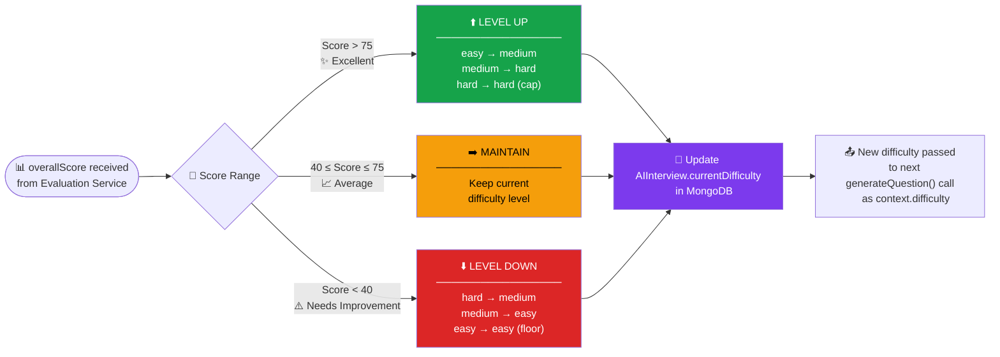

### Difficulty Level Scale

| Score | Label | Effect | Behavior |
|---|---|---|---|
| **> 75** | 🟢 Excellent | Level UP | Next question at higher difficulty |
| **40–75** | 🟡 Average | Maintain | Same difficulty maintained |
| **< 40** | 🔴 Needs Work | Level DOWN | Next question at lower difficulty |

---

## 8. Phase 7 — Database Write After Each Answer

> **Trigger:** Successfully processed audio &nbsp;|&nbsp; **Target:** `AIInterview` MongoDB document

After every evaluation cycle, three sub-arrays in the `AIInterview` document are updated atomically: `answers`, `scores`, and `currentDifficulty`. The document acts as the single source of truth for the entire interview session.

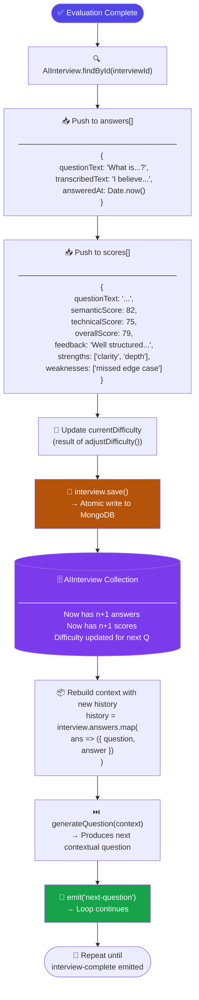

---

## 9. Phase 8 — Interview Completion & Final Report

> **Trigger:** Candidate emits `interview-complete` &nbsp;|&nbsp; **Outcome:** Final score computed, `InterviewSession` status synced, results rendered

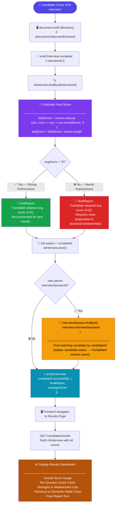

---

## 10. Phase 9 — Admin Audit & Monitoring

> **Who:** Admin &nbsp;|&nbsp; **When:** Any time after interviews are conducted &nbsp;|&nbsp; **Purpose:** System-wide reporting and employee management

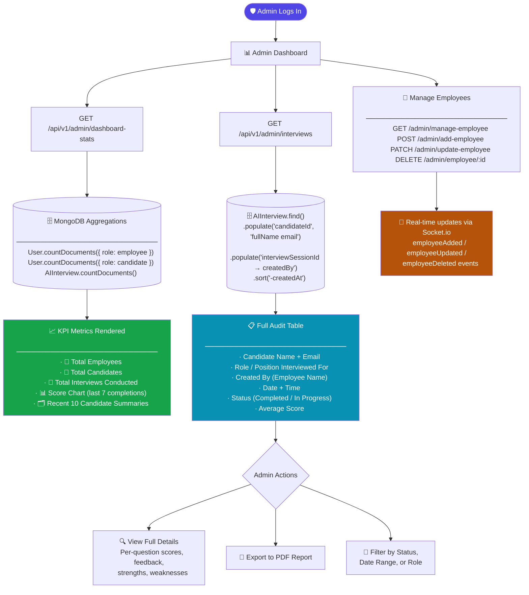

---

## 11. Complete Data Model Relationships

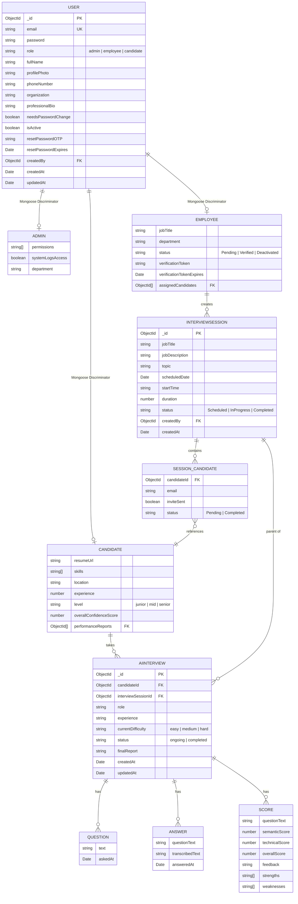

---

## 12. Complete Socket.io Event Reference

### 📤 Client → Server Events

| Event Name | Payload Schema | Description | Phase |
|---|---|---|---|
| `start-interview` | `{ interviewId: string }` | Join the interview room and receive the first question | Phase 3 |
| `send-audio` | `{ interviewId: string, currentQuestionText: string, audioBuffer: ArrayBuffer }` | Submit candidate's voice answer for transcription and evaluation | Phase 5 |
| `interview-complete` | `{ interviewId: string }` | Signal the end of the interview and trigger final report generation | Phase 8 |

### 📥 Server → Client Events

| Event Name | Payload Schema | Description | Phase |
|---|---|---|---|
| `next-question` | `{ questionText: string }` | AI-generated question, delivered after start or each answer | Phase 4 |
| `transcription-result` | `{ transcribedText: string }` | Real-time speech-to-text result shown on screen | Phase 5 |
| `evaluation-result` | `{ evaluation: ScoreObject }` | Full AI evaluation with scores, feedback, strengths, weaknesses | Phase 5 |
| `processing-status` | `{ message: string \| null }` | Loading state message during transcription/evaluation, null clears it | Phase 5 |
| `interview-completed-successfully` | `{ finalReport: string, averageScore: number }` | Signals the end of interview with final summary | Phase 8 |
| `interview-error` | `{ message: string }` | Error emitted for any pipeline failure | All |
| `employeeAdded` | `Employee` | Broadcasts new employee document to admin dashboard | Admin |
| `employeeUpdated` | `Employee` | Broadcasts updated employee document | Admin |
| `employeeDeleted` | `string (id)` | Broadcasts deleted employee ID | Admin |

### ScoreObject Schema

```json
{
  "semanticScore":   75,
  "technicalScore":  80,
  "overallScore":    77,
  "feedback":        "Good conceptual understanding with clear communication...",
  "strengths":       ["Clear explanation", "Relevant example provided"],
  "weaknesses":      ["Missed time complexity discussion"]
}
```

---

## 📌 REST API Quick Reference

| Method | Endpoint | Auth | Role | Purpose |
|---|---|---|---|---|
| `POST` | `/api/v1/user/login` | ❌ | All | Login and receive JWT cookie |
| `POST` | `/api/v1/user/register` | ❌ | Admin | Register new admin account |
| `PATCH` | `/api/v1/user/change-password` | ✅ | All | Update first-time password |
| `POST` | `/api/v1/employee/interview/create` | ✅ | Employee | Create interview session |
| `GET` | `/api/v1/employee/interviews` | ✅ | Employee | List own interview sessions |
| `GET` | `/api/v1/employee/interview/:id` | ✅ | Employee | Get session details |
| `PATCH` | `/api/v1/employee/interview/:id` | ✅ | Employee | Update / reschedule session |
| `POST` | `/api/v1/employee/interview/:id/candidate` | ✅ | Employee | Add candidate to session |
| `DELETE` | `/api/v1/employee/interview/:id` | ✅ | Employee | Delete session |
| `POST` | `/api/v1/employee/interview/generate-prompt` | ✅ | Employee | Generate AI system prompt |
| `GET` | `/api/v1/candidate/my-interviews` | ✅ | Candidate | Fetch assigned interviews |
| `POST` | `/api/v1/ai-interview/start` | ✅ | Candidate | Initialize AI interview session |
| `POST` | `/api/v1/ai-interview/end` | ✅ | Candidate | Mark session as completed via REST |
| `GET` | `/api/v1/admin/dashboard-stats` | ✅ | Admin | System-wide KPI metrics |
| `GET` | `/api/v1/admin/interviews` | ✅ | Admin | All AI interviews (audit) |
| `POST` | `/api/v1/admin/add-employee` | ✅ | Admin | Invite new employee |
| `PATCH` | `/api/v1/admin/update-employee` | ✅ | Admin | Update employee record |
| `DELETE` | `/api/v1/admin/employee/:id` | ✅ | Admin | Remove employee |

---

<div align="center">

---

**VIRQA AI Interview Platform**  
*Final Year Project — University of Central Punjab (UCP) — F22*  
*Built with ❤️ by Muhammad Ummar*

---

*Document generated from live source code analysis — all flows reflect actual implementation*

</div>
