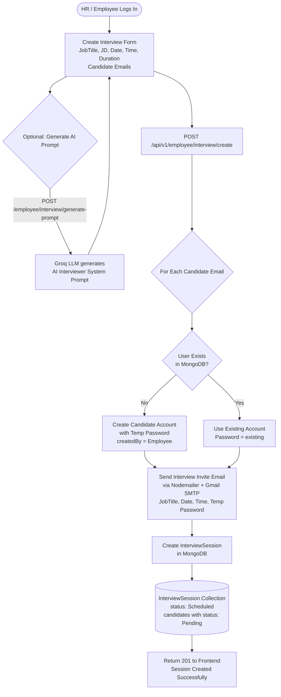
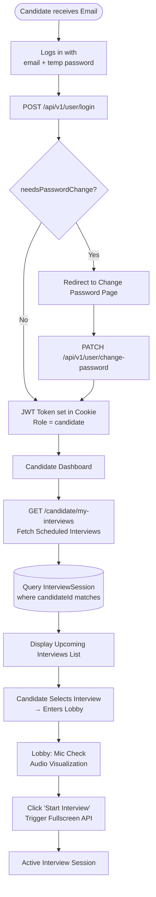
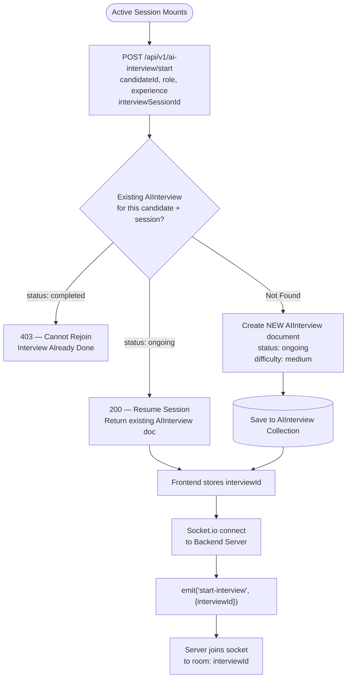
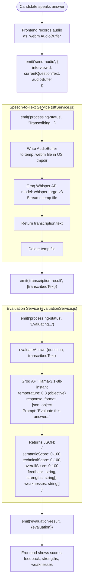
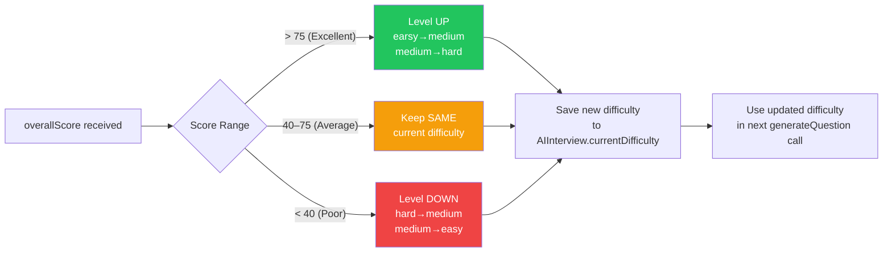
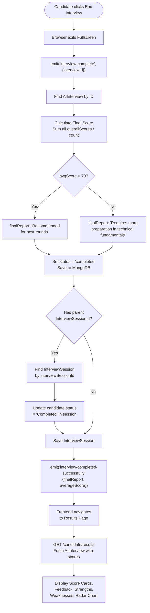
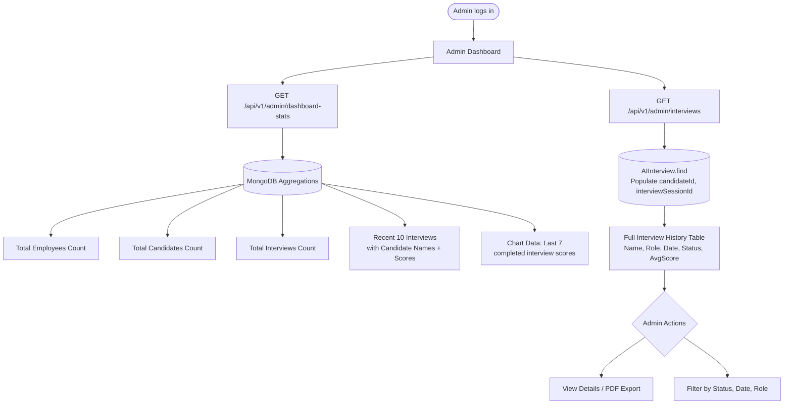
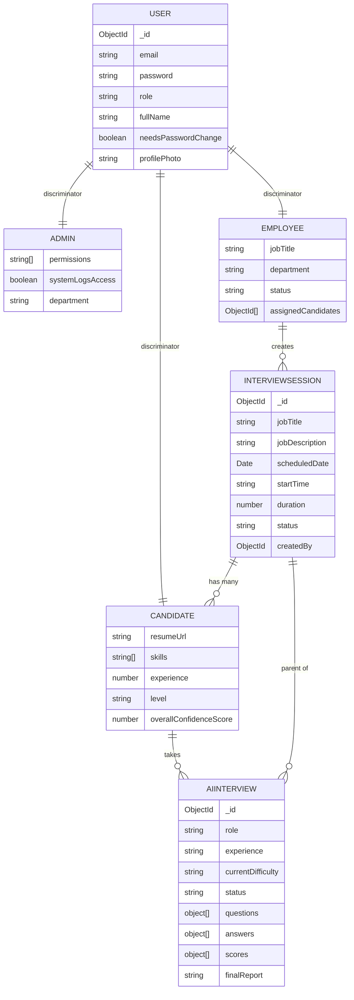

# VIRQA — Complete AI Interview System Diagram

## System Actors & Technology Stack

| Actor | Interface | Technology |
|---|---|---|
| **Admin** | Admin Dashboard | React + Vite |
| **Employee (HR)** | Employee Dashboard | React + Vite |
| **Candidate** | Candidate Portal | React + Vite |
| **Backend** | REST API + Socket.io | Node.js + Express |
| **AI Engine** | LLM Questions & Evaluation | Groq API (llama-3.1-8b-instant) |
| **Speech-to-Text** | Audio Transcription | Whisper large-v3 (Groq) |
| **Database** | Persistence | MongoDB (Mongoose) |
| **Email** | Invitations & OTP | Nodemailer + Gmail SMTP |
| **File Storage** | Profile Photos | Cloudinary |

---

## Phase 1: Interview Session Creation (Employee → Candidates)



---

## Phase 2: Candidate Authentication & Lobby



---

## Phase 3: AI Interview Initialization



---

## Phase 4: Real-Time AI Question Generation

```mermaid
flowchart LR
    A["Socket: start-interview received"] --> B[Fetch AIInterview from DB]
    B --> C{Any unanswered\nquestions?}

    C -->|Yes: Resume| D["Re-emit last\nunanswered question"]
    C -->|No: Fresh| E[Build Context Object]

    E --> E1["context = {\n  role, experience,\n  difficulty: current,\n  history: past Q&A pairs\n}"]
    E1 --> F["questionService.generateQuestion(context)"]

    F --> G["Groq API: llama-3.1-8b-instant\nmodel: 'You are expert tech interviewer...\nRole: {role}, Difficulty: {difficulty}'\ntemperature: 0.7"]

    G --> H{API Success?}
    H -->|Yes| I[Return generated question text]
    H -->|No Fallback| I2["Return: 'Tell me about a recent\nchallenging problem you solved'"]

    I --> J[Save question to\nAIInterview.questions array]
    J --> K["emit('next-question', {questionText})"]
    K --> L[Candidate sees question\non screen + read aloud via TTS]
```



---

## Phase 5: Audio Answer Processing Pipeline



---

## Phase 6: Adaptive Difficulty Engine



---

## Phase 7: Database Write After Each Answer

```mermaid
flowchart TD
    A[Evaluation complete] --> B[Find AIInterview by ID]
    B --> C[Append to answers array\n{questionText, transcribedText, answeredAt}]
    C --> D[Append to scores array\n{semanticScore, technicalScore,\noverallScore, feedback,\nstrengths, weaknesses}]
    D --> E[Update currentDifficulty]
    E --> F[Save document to MongoDB]

    F --> G[Generate NEXT question\nwith updated context + history]
    G --> H["emit('next-question')"]
    H --> I[Repeat loop until\nCandidate ends interview]
```

---

## Phase 8: Interview Completion & Final Report



---

## Phase 9: Admin Audit & Monitoring



---

## Complete Data Model Relationships



---

## Complete Socket.io Event Reference

| Event (Client → Server) | Payload | Description |
|---|---|---|
| `start-interview` | `{ interviewId }` | Join interview room and get first question |
| `send-audio` | `{ interviewId, currentQuestionText, audioBuffer }` | Submit audio answer for processing |
| `interview-complete` | `{ interviewId }` | Signal interview end and generate final report |

| Event (Server → Client) | Payload | Description |
|---|---|---|
| `next-question` | `{ questionText }` | New question generated by AI |
| `transcription-result` | `{ transcribedText }` | Real-time speech-to-text result |
| `evaluation-result` | `{ evaluation }` | Scores + feedback from AI grader |
| `processing-status` | `{ message }` | Loading state updates (Transcribing, Evaluating...) |
| `interview-completed-successfully` | `{ finalReport, averageScore }` | Final summary after interview ends |
| `interview-error` | `{ message }` | Error during any pipeline stage |
| `employeeAdded` | Employee object | Real-time employee list update |
| `employeeUpdated` | Employee object | Real-time employee update |
| `employeeDeleted` | Employee ID | Real-time employee removal |
