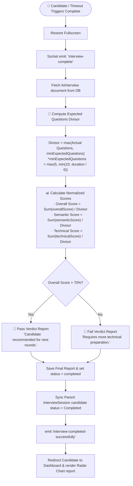

# 🎙️ VIRQA — Live AI Interview Session & Evaluation Flow

This document outlines the end-to-end technical flow of the **Live AI Interview Session** in the VIRQA platform. It details how the candidate's voice audio travels to the backend, how it is transcribed and scored, how the AI's reply is synthesized word-by-word on the screen, and how final reports are compiled upon interview completion.

---

## 1. High-Level Architecture Flow

The interview interaction loop runs entirely over **Socket.io** (real-time WebSockets) for low latency and state synchronization.

```mermaid
sequenceDiagram
    autonumber
    actor Candidate as Candidate (Frontend)
    participant Socket as Socket.io Engine (WS)
    participant Backend as Node.js Backend
    participant STT as Groq Whisper API (whisper-large-v3)
    participant LLM as Groq LLM (llama-3.1-8b-instant)
    database DB as MongoDB (Mongoose)

    Note over Candidate: 1. Candidate speaks into microphone
    Candidate->>Socket: emit("send-audio", { audioBuffer, questionText })
    
    Note over Backend: 2. Backend processes audio
    Socket->>Backend: Handle "send-audio"
    Backend->>STT: Send transient webm audio stream
    STT-->>Backend: Return transcribed text
    Backend->>Candidate: emit("transcription-result", { transcribedText })
    
    Note over Backend: 3. Background Scoring Starts
    Backend->>LLM: evaluateAnswer(question, transcription)
    LLM-->>Backend: Return scores (JSON)
    Backend->>DB: Push answer & evaluation score into DB doc
    Backend->>Candidate: emit("evaluation-result", { evaluation })

    Note over Backend: 4. Generate Next Question
    Backend->>LLM: generateQuestion(context, currentDifficulty)
    LLM-->>Backend: Stream question text in chunks
    Backend->>Candidate: emit("ai-response-chunk", { chunk })
    Backend->>Candidate: emit("ai-response-complete", { questionText })

    Note over Candidate: 5. TTS Real-time Sync Rendering
    Candidate->>Candidate: Synthesize TTS & reveal text word-by-word
```

---

## 2. Step-by-Step Technical Lifecycle

### Step 1: Voice Capture & Streaming (Frontend)
1. The candidate clicks "Start Recording" or speaks into the microphone (with voice capture active).
2. The browser's **MediaRecorder API** captures audio in `.webm` format.
3. Once the candidate finishes speaking (or the timeout is reached), the audio chunks are compiled into an `ArrayBuffer` and emitted:
   ```javascript
   socket.emit("send-audio", {
       interviewId: aiInterviewId,
       currentQuestionText: currentQuestion,
       audioBuffer: arrayBuffer
   });
   ```

### Step 2: Speech-to-Text Transcription (Backend)
1. The backend receives the binary buffer over the websocket.
2. It emits a status update to the frontend: `emit("processing-status", "Transcribing your answer...")`.
3. The backend writes the buffer temporarily to the OS temp directory:
   `path.join(os.tmpdir(), "audio-{timestamp}.webm")`.
4. It calls **Groq's Whisper API** (`whisper-large-v3`) with the read stream.
5. Once transcribed, it returns the string and deletes the temp file immediately.
6. The backend emits the transcription back to the candidate's browser screen:
   `emit("transcription-result", { transcribedText })`.

### Step 3: Asynchronous Answer Evaluation (Backend)
To prevent conversation delay, the system grades the answer in the background:
1. The backend calls `evaluateAnswer` in [evaluationService.js](file:///c:/Users/ummar/Desktop/Virqa/VIRQA-Project/backend/src/services/evaluationService.js).
2. The LLM processes the question and transcription with a low temperature (`0.3`) for consistent grading.
3. The LLM returns a structured JSON containing:
   *   `semanticScore` (Relevance)
   *   `technicalScore` (Technical correctness)
   *   `overallScore` (Weighted score)
   *   `feedback` (Concise assessment)
   *   `strengths` and `weaknesses`
4. The backend writes this score object into the `AIInterview` database document's `scores` array.
5. It scales difficulty using the **Adaptive Difficulty Engine** (e.g. raises difficulty if score > 75, lowers it if < 40).
6. It emits the scores to the candidate: `emit("evaluation-result", { evaluation })`.

### Step 4: Contextual Next Question Generation (Backend)
While scoring happens in the background, the interviewer creates the next question:
1. The system extracts the full Q&A history from the database.
2. It calls **Groq's LLM** (`llama-3.1-8b-instant`) with a temperature of `0.7` to ensure dynamic questions.
3. The LLM streams the text chunk-by-chunk to the server.
4. The server emits chunks to the client: `emit("ai-response-chunk", { chunk })`.
5. Once generated completely, it updates the database and emits:
   `emit("ai-response-complete", { questionText })`.

### Step 5: Real-Time TTS Text-Sync Rendering (Frontend)
1. **Typing Phase:** While `ai-response-chunk` events stream, the candidate view displays a blinking bouncing-dots typing bubble in the chat feed to signal the interviewer is thinking.
2. **Speaking Phase:** When `ai-response-complete` triggers, the browser cancels any ongoing speech and builds a `SpeechSynthesisUtterance`:
   *   It attaches to the native `speechSynthesis` engine.
   *   It binds to the `onstart` event to hide the typing bubble and make the message box empty.
   *   It binds to the `onboundary` event (filtering by `event.name === 'word'`). As the engine pronounces each word, it reads the character boundaries and slices the text progressively, rendering words on the screen in **real-time** as they are spoken.
3. **Safety Fallback:** A `1.5` second timeout monitors the speech engine. If browser permissions block speech synthesis, the fallback automatically triggers to display the text fully so the interview doesn't freeze.
4. **Recording Restarts:** On `onend` (or error/fallback completion), the system automatically activates the microphone to capture the candidate's next answer.

---

## 3. End-of-Interview Evaluation Flow

When the candidate finishes or the time limit expires, the final grading and reporting pipeline triggers.



### Dynamic Penalization for Early Exits
The overall grade calculation divides the sum of scores by a normalized divisor:
$$\text{Divisor} = \max(\text{Questions Answered}, \text{Expected Questions Threshold})$$

*   **Expected Questions:** Calculated as $1$ question per $6$ minutes of scheduled interview duration (minimum of $5$ questions, maximum of $10$).
*   **Result:** A candidate who answers only $1$ question perfectly and then exits early gets their total score divided by $5$ (for a 30-minute interview), penalizing their overall rating to $20\%$, which ensures fairness across all candidates.

---

## 4. Key Socket.io Events Reference

### Client-to-Server
*   `start-interview` (`{ interviewId }`): Initiates the interview socket channel.
*   `send-audio` (`{ interviewId, currentQuestionText, audioBuffer }`): Sends the spoken answer buffer to transcribe and score.
*   `send-message` (`{ interviewId, currentQuestionText, message }`): Alternative text-input submission.
*   `interview-complete` (`{ interviewId }`): Signals that the candidate has completed the session.

### Server-to-Client
*   `processing-status` (`{ message }`): Updates candidate UI loading text (e.g. "Transcribing...").
*   `transcription-result` (`{ transcribedText }`): Returns the Whisper-transcribed text to show in the chat log.
*   `evaluation-result` (`{ evaluation }`): Returns the per-answer scores, feedback, strengths, and weaknesses.
*   `ai-response-chunk` (`{ chunk }`): Streams the dynamic question generation tokens.
*   `ai-response-complete` (`{ questionText }`): Signals generation is complete and prompts TTS synthesis to begin.
*   `interview-completed-successfully` (`{ finalReport }`): Triggers redirect and completion screens.
